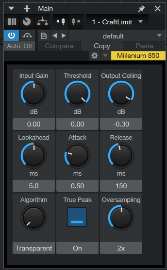

# CraftLimit

**A stereo-linked peak limiter VST3 plugin, built with JUCE and C++.**



---

## Overview

CraftLimit is a single-band peak limiter for mix-bus and mastering use. It implements a look-ahead architecture with stereo-linked gain reduction, five program-dependent algorithm presets, and optional 2x or 4x oversampling for true-peak (inter-sample) limiting.

The plugin is part of the Craft Audio ecosystem and is developed as a learning project in audio software engineering. It has been tested in Studio One 6 on Windows with guitar and program material.

---

## Features

- Look-ahead peak limiting (the gain envelope ramps down before the peak reaches the output)
- Stereo-linked gain reduction (single shared envelope preserves the stereo image during limiting)
- Five algorithm presets: Transparent, Dynamic, Aggressive, Surgical, Bus
- True-peak detection via 2x or 4x oversampling (FIR equiripple half-band, linear phase)
- Soft-knee curve per algorithm
- Hard ceiling clamp guarantees output ceiling is respected
- Host-reported latency includes oversampler group delay and look-ahead delay
- Lock-free parameter updates via dirty-flag pattern

---

## Architecture

```
   in (L,R) --> Input Gain --> [Oversampler 1x/2x/4x] --> Limiter --> [Downsampler] --> out

   Limiter internals (per sample):
     write sample into delay line (per channel)
     scan L most recent samples for peak (per channel)
     peak = max(peakL, peakR)                              <-- stereo link
     compute target gain (soft knee curve)
     update envelope (attack / hold / release)             <-- shared L+R
     read delayed sample, multiply by envGain
     hard ceiling clamp
     advance write position
```

The DSP layer (LimiterDSP.h/.cpp) is fully decoupled from JUCE and has no plugin-framework dependencies, making it reusable in other hosts or for offline processing.

---

## DSP Details

### Look-ahead architecture

Each channel maintains a circular buffer sized for the maximum supported look-ahead at the maximum effective sample rate. The buffer is allocated once at prepareToPlay and never re-allocated at runtime; look-ahead changes only adjust the active read offset.

On each sample, the channel:
1. Writes the new input at writePos
2. Scans the L most recent samples (the upcoming output window) for the peak
3. Reads the delayed output sample at writePos - L
4. Advances writePos

This is the correct interpretation of look-ahead: the peak detector observes samples that will exit the delay line over the next L iterations, giving the gain envelope time to ramp down before the peak hits the output stage.

### Stereo linking

The gain envelope (envGain, holdCounter) lives in the StereoLimiter class, not per-channel. Each sample, both channels write into their delay lines, both look-ahead windows are scanned independently, and `peak = max(peakL, peakR)` drives a single target-gain calculation. One envelope update produces one envGain value, applied identically to both delayed channels.

The result: peaks on either channel produce equal gain reduction on both, preserving the stereo image.

### Soft knee

For algorithms with non-zero knee width (Dynamic, Surgical, Bus), the gain calculation uses a quadratic curve in dB:

```
below knee:  no reduction
inside knee: gainDb = (threshold - knee/2) + x^2 * knee/2
             where x = (peakDb - (threshold - knee/2)) / knee
above knee:  gainLin = threshold / peak
```

This produces a smooth transition from no-reduction to full-limiting, audibly softer than hard-knee at moderate threshold settings.

### Envelope follower

Standard one-pole IIR with separate attack and release coefficients, plus a configurable hold timer that resets on each new attack event, preventing premature release on sustained peaks.

### Algorithm presets

Each preset is a 4-tuple (attackMul, releaseMul, holdMs, kneeDb):

| Preset       | Attack x | Release x | Hold (ms) | Knee (dB) |
|--------------|---------:|----------:|----------:|----------:|
| Transparent  |     1.00 |      1.00 |       0.0 |       0.0 |
| Dynamic      |     0.50 |      2.00 |       2.0 |       0.5 |
| Aggressive   |     0.10 |      0.30 |       0.0 |       0.0 |
| Surgical     |     0.05 |      0.80 |       5.0 |       1.0 |
| Bus          |     0.80 |      1.50 |       1.0 |       0.3 |

The attackMul and releaseMul are applied to the user-set Attack/Release knobs, so each algorithm has its own time-character while still being user-tweakable.

### Oversampling for true-peak

When True Peak is enabled, the signal is upsampled (2x or 4x) before the limiter and downsampled after, via juce::dsp::Oversampling configured with the linear-phase FIR equiripple half-band filter family. At 4x oversampling, inter-sample peaks are caught by the standard sample-peak detector in the upsampled domain.

Three oversampler instances (1x passthrough, 2x, 4x) are pre-allocated at prepareToPlay and selected via an atomic index at runtime. Switching modes during playback never allocates on the audio thread.

### Thread-safe parameter updates

The plugin uses a dirty-flag pattern for cross-thread parameter handoff:

- Message thread: when any parameter changes, set paramsDirty_ = true (release ordering)
- Audio thread: at the start of each processBlock, exchange(false, acquire); if dirty, refresh all limiter coefficients from the APVTS atomics

This means the limiter's internal state is mutated only from the audio thread, so its member variables do not need to be atomic. The cross-thread cost is a single atomic load per block.

---

## Parameters

| Parameter        | Range            | Default | Notes                                  |
|------------------|------------------|---------|----------------------------------------|
| Input Gain       | -18 to +18 dB    | 0 dB    | Pre-limiter gain                       |
| Threshold        | -30 to 0 dB      | 0 dB    | Below this peak level, no reduction    |
| Output Ceiling   | -6 to 0 dB       | -0.3 dB | Hard clamp on the output               |
| Lookahead        | 0 to 20 ms       | 5 ms    | Buffer pre-allocated for 30 ms max     |
| Attack           | 0.1 to 50 ms     | 0.5 ms  | Scaled per algorithm                   |
| Release          | 10 to 2000 ms    | 150 ms  | Scaled per algorithm                   |
| Algorithm        | 5 presets        | Transparent | See table above                    |
| True Peak        | On / Off         | On      | Enables the oversampling pipeline      |
| Oversampling     | 1x / 2x / 4x     | 2x      | Active only when True Peak is on       |

---

## Build

### Prerequisites

- CMake 3.22 or higher
- JUCE 8 (cloned into the project root as a subdirectory)
- C++17 compiler: MSVC 2022/2026, Clang 14+, or GCC 11+

### Building on Windows

```
git clone https://github.com/indjoov/craftlimit.git
cd craftlimit
git clone https://github.com/juce-framework/JUCE.git

cmake -B build -G "Visual Studio 17 2022" -A x64
cmake --build build --config Release
```

The VST3 will be at `build\CraftLimit_artefacts\Release\VST3\CraftLimit.vst3`. To install it system-wide, copy that folder to `C:\Program Files\Common Files\VST3\`.

### Building on macOS

```
git clone https://github.com/indjoov/craftlimit.git
cd craftlimit
git clone https://github.com/juce-framework/JUCE.git

cmake -B build -G Xcode
cmake --build build --config Release
```

---

## Tested In

- Studio One 6 (Windows 11, JUCE 8, MSVC 14.5): GUI renders, audio passes through, threshold and algorithm changes produce audible and correct gain reduction, output stays clean at heavy limiting settings (threshold -20 dB, Aggressive preset).

---

## Engineering History

This project began as a v0.9 prototype that compiled and ran but contained several DSP correctness issues. A code review during preparation for the v1.0 release identified and fixed:

1. **Look-ahead direction.** The original peak scan ran forwards from the write position, reading stale samples from the previous buffer cycle instead of the upcoming output window. Fixed by scanning backwards from the write position.
2. **Stereo linking.** The original code ran two independent per-channel envelopes, which shifted the stereo image during limiting. Refactored so the envelope state lives in StereoLimiter and is driven by max(peakL, peakR).
3. **True-peak / oversampling.** The truePeak and oversamplingFactor parameters existed in the parameter layout but were not wired into the audio path. The processor now hosts a real juce::dsp::Oversampling pipeline with three pre-allocated oversamplers.
4. **Output ceiling double-application.** The original code multiplied by ceiling twice (envelope stage and output stage). Replaced with a single hard clamp after the limiter stage.
5. **Thread-safe parameter updates.** The original code mutated limiter state directly from the parameter-listener thread while the audio thread was reading it. Replaced with the dirty-flag pattern described above.

Each fix is documented in the source comments at the relevant call site.

---

## Roadmap

- Visual peak and GR metering on the front panel (currently relies on host meters)
- M/S processing mode
- Apple Silicon native build
- AAX format
- Preset browser with named program states
- Unit tests for the DSP layer (offline rendering against reference fixtures)

---

## License

MIT - see LICENSE.

---

## Author

**Niki Indjov** - Audio Software Developer & Musician, Berlin

- indjoov.com
- github.com/indjoov

CraftLimit is part of the Craft Audio ecosystem.
